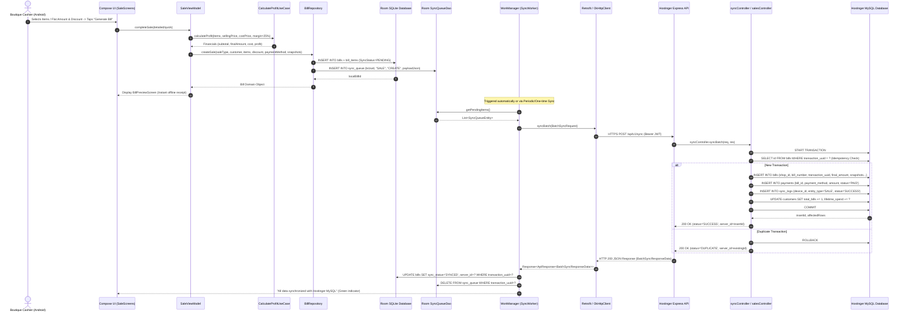

# MATOSHREE COLLECTION — COMPLETE DATA FLOW TRACE

This document traces the complete end-to-end data flow for sales, synchronization, and persistence between **Android (Jetpack Compose + Room)**, **Hostinger Node.js REST API**, and **Hostinger MySQL Database**.

---

## 1. End-to-End Data Flow Architecture

---

## 2. Detailed Step-by-Step Breakdown

### Step 1 — UI & ViewModel Execution
- **Trigger**: Cashier inputs items or quick sale amount, selects discount (Flat ₹ / Percentage %), picks payment method (Cash / UPI / Other), and taps **"Complete & Generate Bill"**.
- **Action**: `SaleViewModel.completeSale()` gathers active cart state and invokes `BillRepository.createSale()`.

### Step 2 — Offline-First Room Storage & Snapshot Capture
- **Repository Execution**:
  1. Generates unique `transactionUuid` (`UUID.randomUUID()`).
  2. Generates sequential boutique invoice number (e.g., `MC-2026-000001`).
  3. Captures current shop branding snapshots (`shop_name_snapshot`, `shop_address_snapshot`, `shop_mobile_snapshot`, `shop_gstin_snapshot`, `show_gstin_snapshot`) from `SettingsDao`.
  4. Inserts `BillEntity` and `BillItemEntity` rows atomically in local SQLite via Room (`SyncStatus.PENDING`).
  5. Inserts payload into `sync_queue` table with status `PENDING`.
  6. Returns `Bill` domain model immediately so the cashier sees the receipt without waiting for network.

### Step 3 — Background Synchronization Engine (`SyncWorker`)
- **Execution**:
  1. `SyncWorker` is triggered by Android `WorkManager` (periodic every 15 mins or manual "Sync Now").
  2. Queries `sync_queue` for un-synced items (`getPendingItems()`).
  3. Verifies JWT token from `TokenStorage`. If token is absent or expired, automatically invokes `POST /api/v1/auth/login` to obtain a fresh token.
  4. Dispatches `POST /api/v1/sync` payload with `BatchSyncRequest` via Retrofit over TLS/HTTPS.

### Step 4 — Hostinger Backend Processing & MySQL Transaction
- **Endpoint**: `POST /api/v1/sync`
- **Controller Logic**:
  1. `syncController.syncBatch` parses incoming `sync_items`.
  2. Opens dedicated MySQL connection and executes `connection.beginTransaction()`.
  3. **Idempotency Guard**: Queries `SELECT id, bill_number FROM bills WHERE transaction_uuid = ?`. If found, rolls back and returns status `DUPLICATE` with existing `server_id`.
  4. If new, inserts into `bills`, `bill_items`, and `payments` tables with accurate decimal monetary amounts and snapshot fields.
  5. Updates customer loyalty records (`total_bills`, `lifetime_spend`, `last_purchase_at`).
  6. Inserts log record into `sync_logs`.
  7. Executes `connection.commit()`.
  8. Returns HTTP 200 response with array of results containing `server_id` and `status`.

### Step 5 — Local State Reconciliation & UI Update
- **Android Receipt**:
  1. For each `SUCCESS` or `DUPLICATE` result, `SyncRepository` deletes the item from `sync_queue`.
  2. Updates `BillEntity.syncStatus = SYNCED` and `BillEntity.serverId = res.server_id` in Room.
  3. Flow updates `pendingSyncCount`, transitioning the Settings UI to display `"All data synchronized with Hostinger MySQL"`.
